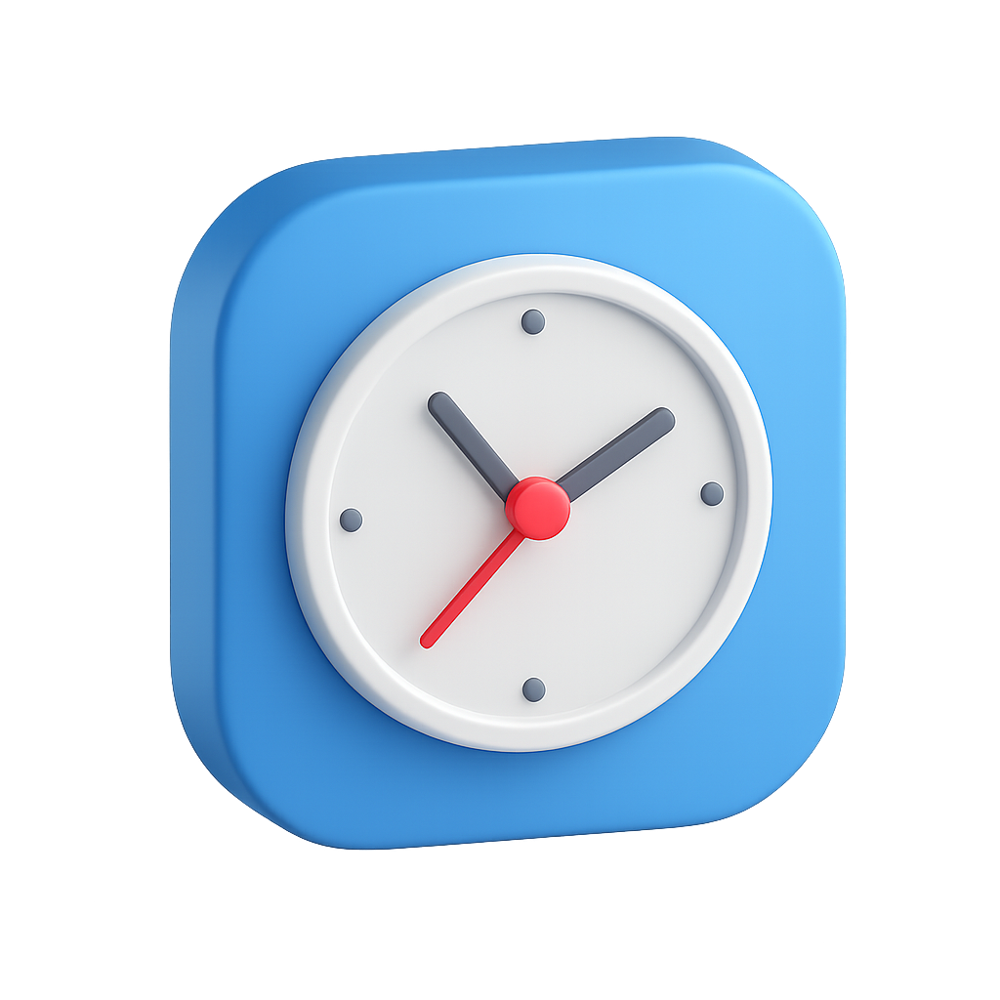

# CLOKD - Simple Time Tracking App

CLOKD is a minimalist and intuitive web-based time tracking application designed to help you log tasks, categorize them with tags, and visualize your time distribution across different projects. Built entirely with HTML, CSS, and JavaScript, CLOKD offers a clean user interface and essential features for personal time management.

## Table of Contents

-   [Features](#features)
-   [Technologies Used](#technologies-used)
-   [Getting Started](#getting-started)
    -   [Prerequisites](#prerequisites)
    -   [Installation](#installation)
-   [Usage](#usage)
    -   [Time Tracker](#time-tracker)
    -   [Manual Entry](#manual-entry)
    -   [Tags Management](#tags-management)
    -   [Time Logs](#time-logs)
    -   [Reports](#reports)
    -   [Dark Mode](#dark-mode)
-   [Project Structure](#project-structure)
-   [Customization](#customization)
-   [Acknowledgements](#acknowledgements)
-   [License](#license)

## Features

CLOKD provides the following core functionalities:

*   **Intuitive Time Tracking:** Start, pause, and stop a timer for your current tasks with a visual circular progress display.
*   **Manual Time Entry:** Easily add past activities with specific start and end times, perfect for logging forgotten tasks.
*   **Flexible Tagging System:** Organize your tasks with custom tags and assign unique colors for better categorization and visual distinction.
*   **Project Management:** Assign tasks to predefined projects (Work, Study, Personal, Break, Other) or create custom project names.
*   **Comprehensive Time Logs:** View a detailed table of all your recorded time entries, including task name, project, tags, start/end times, and duration.
*   **Edit & Delete Logs:** Modify existing time entries or remove them entirely with a confirmation prompt.
*   **Continue Task:** Seamlessly resume a previously logged task, adding new time to its existing duration.
*   **Dynamic Reports:**
    *   **Time Distribution Pie Chart:** Visualize how your time is distributed across different projects.
    *   **Project Breakdown:** See detailed statistics for each project, including total time and percentage of overall time.
    *   **Flexible Filtering:** Filter reports by predefined periods (Today, This Week, This Month, All Time) or select a **Custom Date** using a calendar date picker.
*   **PDF Report Export:** Download a summary of your filtered time logs as a PDF document.
*   **Dark Mode:** Toggle between light and dark themes for a comfortable viewing experience.
*   **Responsive Design:** Enjoy a consistent and user-friendly experience across various devices (desktop, tablet, mobile).
*   **Local Storage Persistence:** All your time entries and settings are saved locally in your browser, so your data persists even after closing the tab.

## Technologies Used

*   **HTML5:** For structuring the web content.
*   **CSS3:** For styling and responsive design.
*   **JavaScript (ES6+):** For all interactive functionalities and data management.
*   **Canvas API:** Used for rendering the dynamic pie chart in the Reports section.
*   **Local Storage API:** For persisting user data (tasks, theme preference) directly in the browser.
*   **Inter Font:** A clean and modern typeface for improved readability.

## Getting Started

Follow these instructions to get a copy of the project up and running on your local machine.

### Prerequisites

You only need a modern web browser (e.g., Chrome, Firefox, Safari, Edge).

### Installation

1.  **Clone the repository (or download the files):**
    \`\`\`bash
    git clone https://github.com/your-username/clokd.git
    # Replace with your actual repository URL if you host it on GitHub
    \`\`\`
    If you don't use Git, you can simply download the project files as a ZIP archive and extract them.

2.  **Open `index.html`:**
    Navigate to the `clokd` directory and open the `index.html` file directly in your web browser.
    \`\`\`bash
    cd clokd
    open index.html # On macOS
    start index.html # On Windows
    # Or simply double-click the file in your file explorer
    \`\`\`

The application will load in your browser, and you can start tracking your time immediately.

## Usage

### Time Tracker

1.  **Enter Task Name:** Type what you're working on in the "What are you working on?" input field.
2.  **Select Project:** Choose a project from the dropdown or select "Other" to enter a custom project name.
3.  **Add Tags:** Type a tag name, select a color, and click "Add" to categorize your task.
4.  **Start/Pause/Stop:**
    *   Click the ▶ **Start** button to begin tracking.
    *   Click the ⏸ **Pause** button to temporarily stop the timer. It will change to ▶ **Resume** to continue.
    *   Click the ⏹ **Stop** button to end the current task and save it to your logs.

### Manual Entry

1.  Click the **+ Manual Entry** button in the Tracker section.
2.  Fill in the task name, project, tags, and precise start and end date/times.
3.  The duration will be automatically calculated.
4.  Click **Save Entry** to add it to your logs.

### Tags Management

*   In both the "Time Tracker" and "Manual Entry" forms, you can add multiple tags to a task.
*   Each tag can have a custom color.
*   Click the "×" icon next to a tag to remove it from the current task.

### Time Logs

*   Navigate to the "Logs" section to view all your recorded time entries in a table format (desktop) or card format (mobile).
*   **Edit:** Click the "Edit" button next to an entry to open the manual entry modal pre-filled with that entry's data for modification.
*   **Delete:** Click the "Delete" button to remove an entry. A confirmation modal will appear to prevent accidental deletions.
*   **Continue:** Click the "Continue" button to load the task details into the main tracker and resume tracking time for it, adding to its original duration.

### Reports

*   Go to the "Reports" section to see visual breakdowns of your time.
*   **Time Filter:** Use the "Today", "This Week", "This Month", "All Time", or "Custom" dropdown to filter the data.
    *   Selecting "Custom" will reveal a date picker, allowing you to choose a specific day.
*   **Project Filter:** Use the "All Projects" dropdown to filter data by a specific project.
*   **Time Distribution:** A pie chart visually represents the percentage of time spent on each project.
*   **Project Breakdown:** A list showing the total duration and percentage for each project.
*   **Download PDF Report:** Click the "Download PDF Report" button to generate and download a printable PDF of your currently filtered time logs.

### Dark Mode

*   Click the sun/moon icon in the top-right corner of the page to toggle between light and dark themes. Your preference will be saved.

## Project Structure

The project consists of three main files:

\`\`\`
.
├── index.html    # The main HTML structure of the application.  
├── style.css     # Contains all the CSS rules for styling the app.  
├── script.js     # Implements all the interactive logic and data handling.  
└── clockd-logo.png # Application favicon/logo.
\`\`\`

## Customization

You can easily customize the app's appearance by modifying the `style.css` file:

*   **Colors:** Adjust the CSS variables defined in the `:root` selector (e.g., `--dark-blue`, `--medium-blue`, `--white`) to change the color palette.
*   **Fonts:** Change the `font-family` in the `body` selector to use a different font.
*   **Layout:** Modify flexbox and grid properties in `style.css` to adjust element positioning and responsiveness.

## Acknowledgements

CLOKD was created by **Cristieneil Ceballos**, an aspiring UI/UX and frontend developer. It is inspired by [Toggl Track](https://toggl.com/track/).

## License

This project is open-source and available under the MIT License.
